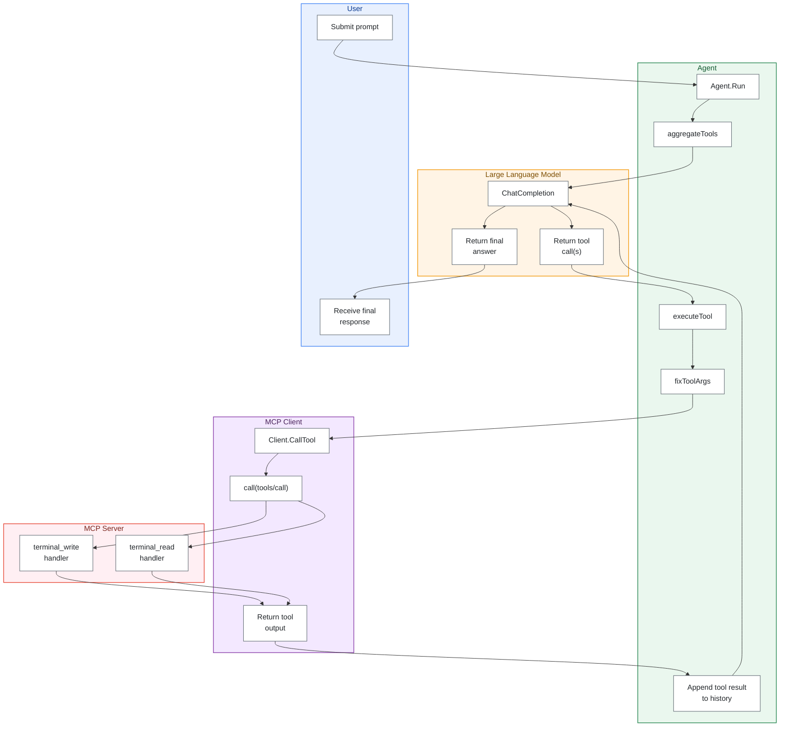

# agent-go

Simple Agent with prompt and tooling capabilities.


- Connects to a configured LLM Model (far example a qwen3.5 running in Ollama locally)
- Configure MCP servers
- Configure Context size
- Chat via the build-in prompt
- Request to do several tasks with one prompt (it works if the LLM Model is smart enough to handle it)
- The prompts history is saved to `/tmp/agent-go-history`, run with `--nohistory=true` to prevent saving the history to file

This agent works well with **shell-mcp** https://github.com/mrqzzz/shell-mcp to execute shell commands in a stateful way.


## Flow



[](https://github.com/mrqzzz/agent-go/actions)
[](https://github.com/mrqzzz/agent-go/releases/latest)

---

## Download Binaries

Download the latest compiled version for your platform. These links point to the most recent official release:

| Operating System | Architecture | Download |
| :--- | :--- | :--- |
| 🪟 **Windows** | x86_64 | [Download .exe](https://github.com/mrqzzz/agent-go/releases/latest/download/agent-go-windows-amd64.exe) |
| 🐧 **Linux** | x86_64 | [Download binary](https://github.com/mrqzzz/agent-go/releases/latest/download/agent-go-linux-amd64) |
| 🍎 **macOS** | Apple Silicon (M1/M2/M3) | [Download binary](https://github.com/mrqzzz/agent-go/releases/latest/download/agent-go-darwin-arm64) |
| 🍎 **macOS** | Intel | [Download binary](https://github.com/mrqzzz/agent-go/releases/latest/download/agent-go-darwin-amd64) |

## Build

Build locally:

Run build.sh from the repo root to build the binary.


## Configure

Edit the file `config.yaml`: 
change the LLM to use :
```
ai:
  provider: "ollama"
  model: "qwen3.5:latest" 
  api_key: "http://localhost:11434"
  prompt_timeout: "20m"
  context_size: 8192
  max_history_lines: 5000
  max_history_messages: 10000
```

add MCP servers (tools) :
```
mcp_servers:
  shell-mcp:
    command: "/Users/marcus.oblak/go/src/github.com/mrqzzz/shell-mcp/shell-mcp" 
    internal_timeout: "2m"
    args: [] 
```

## Distribute

You only need the binary `agent-go` and `config.yaml`

## Usage

### Interactive: 

Start the agent running `./agent-go` and interact normally.
Ask the agent to execute something that you MCP servers can handle. For example, if you have the "shell-mcp" tool in your config, your prompt can be something like this:

You >`evaluate the env.variable "SECRET_PASS" and remember the escaped value as the password to use later, then execute "ssh user@domain.com" and use that password when prompted and when a passphrase is asked, then call "ls -la"`


### Batch:
You can also pass agent-go a file with a sequence of prompts, one per line.

For example, run  `./agent-go prompts.txt >log.txt` — each line of `prompts.txt` will be executed individually in order, while the logs will be dumped to the file `log.txt`, and then the program will exit.

### Flags: 
`--debug`: enable verbose internal logs; 
`--nohistory`: disable saving/restoring persisted history.

### LLM temperature on failure

Behavior: If a command fails, the agent slightly increases the LLM's temperature parameter so the model can try alternative solutions. The change is small and temporary to encourage different approaches without making outputs wildly random.

### Context rot

Yes it rots, so work with few well designed prompts.

### MCP servers & prompt guidance

Advice: When using MCP servers (shell tools), make prompts precise and restrictive to avoid unwanted actions. Include safety constraints such as: "don't delete or modify any file, unless told to" to prevent accidental destructive operations.


### Disclaimer

Remember that AI Agents may produce unexpected results based on the AI model decision. I do not accept responsibility for the outputs or actions of these models.
